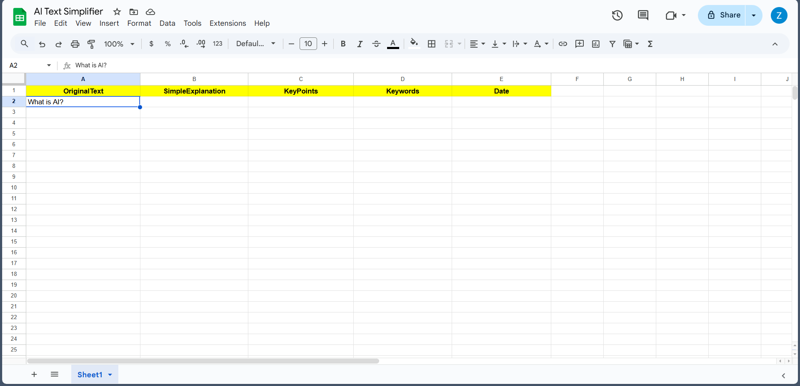
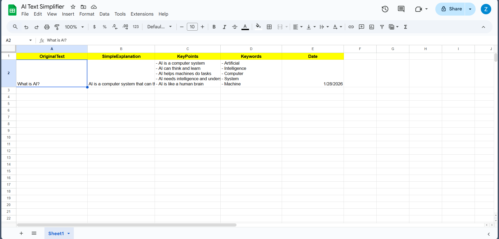
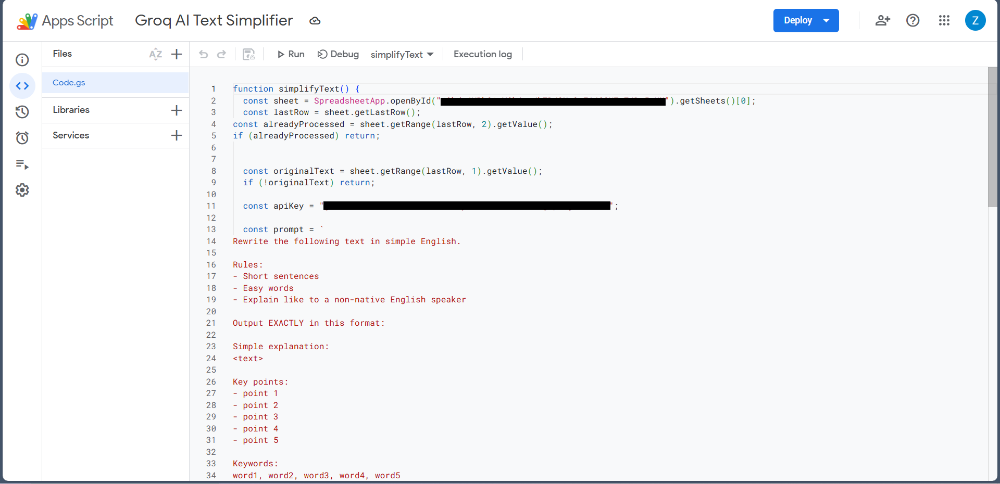

# AI Text Simplifier & Knowledge Logger

An AI-powered Google Sheets automation that converts complex text into
simple explanations, key points, and keywords, and stores them in a
structured knowledge base.

---

## 🔍 Problem
People often read long or complex texts but struggle to:
- understand them quickly
- extract key ideas
- organize knowledge for later use

---

## ✅ Solution
This project uses an AI model to:
- simplify complex text into plain English
- extract key points
- generate relevant keywords
- store everything automatically in Google Sheets

---

## ⚙️ How it works
1. User pastes text into Google Sheets
2. Google Apps Script sends the text to Groq AI
3. The AI processes the text using a structured prompt
4. Results are parsed and saved into separate columns:
   - Simple explanation
   - Key points
   - Keywords
   - Date

---

## 🧰 Tech stack
- Google Sheets
- Google Apps Script (JavaScript)
- Groq API (LLaMA 3.1)

---

## 🧠 Skills demonstrated
- AI API integration
- Prompt engineering
- Automation design
- Data parsing
- Debugging permissions and quotas

---

## 📸 Screenshots

### Input

### Output

### Apps Script

